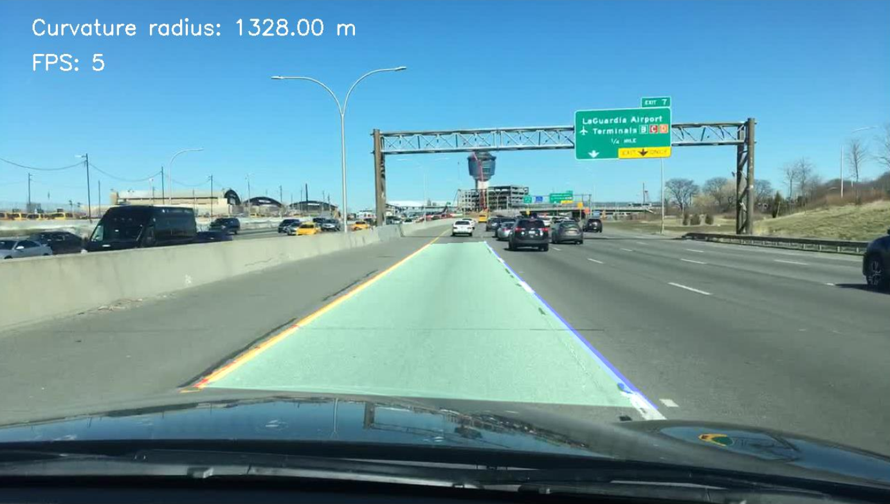
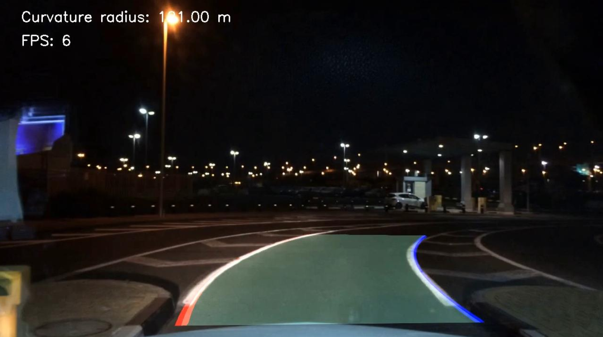

# lane-detection

## Description

Lane detection with conventional computer vision techniques using OpenCV.

## Examples




## ToDo

- [ ] Skip Frames to increase FPS

## Installation

```
Tested on:

Anaconda 4.10.3
Python 3.8.12
OpenCV 4.0.1
```

## Run

Run code:

```
conda create --name venv python=3.8
conda activate venv
python detect_lanes.py 
conda deactivate
```

```
# Generates necessary data for camera calibration
python lane_detection\calibrate_camera.py
```

## Datasets

| Dataset                                                             | clips     | Length/clip   | FPS   | Scenes |
| ------------------------------------------------------------------- | -------:  | :-----------: | :---: | :------: |
| [CULane](https://xingangpan.github.io/projects/CULane.html)         | 55h       | frame             | -     | normal, crowded, night, no line, shadow, arrow, dazzle light, curve,                                                                                                              crossroad |
| [BDD100k](https://bdd-data.berkeley.edu/)                           | #100k    | 40sec         | 30    | city & residential & highway / diverse weather conditions / different                                                                                                             times of the day |
| [TUSimple](https://github.com/TuSimple/tusimple-benchmark/issues/3) | #3626    | 1 sec         | 20    | highway / good and medium weather / day time |

